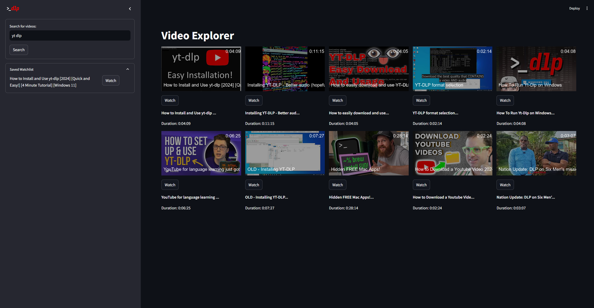
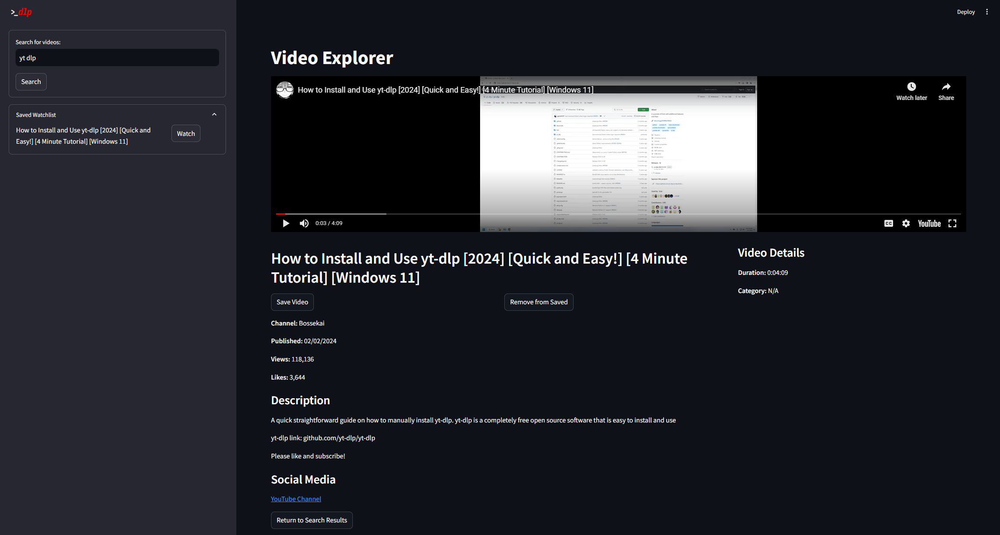

# Video Explorer
Video Explorer is an interactive web application built using Streamlit that enables users to search, view, and save YouTube videos. The application uses yt-dlp for video downloading and metadata extraction, and provides a user-friendly interface for exploring video content.

<table>
  <tr>
    <td>
      
    </td>
    <td>
      
    </td>
  </tr>
</table>

## Connect with Me
| Contact Info       |                      |
|--------------------|----------------------|
| Joseph LePore  | [](https://www.linkedin.com/in/joseph-lepore-062561b3/)    |

## Features

- **Video Search**: Find YouTube videos by entering a query.
- **Video Playback**: Play videos directly within the application.
- **Video Details**: View detailed information, including title, duration, description, and more.
- **Save to Watchlist**: Save videos for later viewing.
- **Custom Thumbnails**: Generate thumbnails with overlays.

## Installation

To set up Video Explorer, follow these steps:

1. **Clone the repository**:
    ```sh
    git clone https://github.com/leporejoseph/yt-dlp-Streamlit.git
    cd yt-dlp-Streamlit
    ```

2. **Install the dependencies**:
    ```sh
    pip install -r requirements.txt
    ```

3. **Run the application**:
    ```sh
    streamlit run app.py
    ```

## Usage

1. **Search for Videos**: Use the search bar to find videos.
2. **Watch Videos**: Click on a video to view and play it.
3. **Save Videos**: Save videos to your watchlist for future viewing.

## Contribution

Contributions to Video Explorer are welcome! To contribute:

1. **Fork the repository**:
    ```sh
    git fork https://github.com/leporejoseph/yt-dlp-Streamlit.git
    ```

2. **Create a new branch**:
    ```sh
    git checkout -b feature/your-feature-name
    ```

3. **Make your changes** and commit them:
    ```sh
    git commit -m "Add your message here"
    ```

4. **Push to your fork**:
    ```sh
    git push origin feature/your-feature-name
    ```

5. **Create a pull request**.

---
